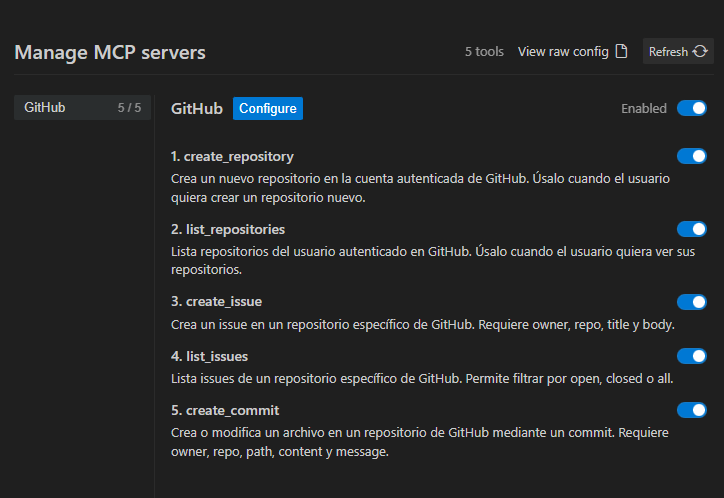
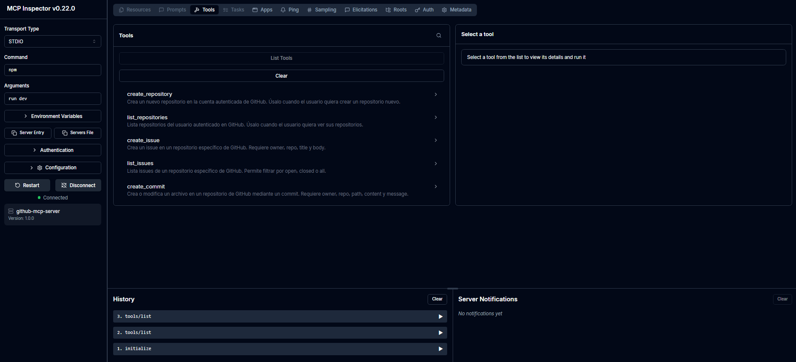
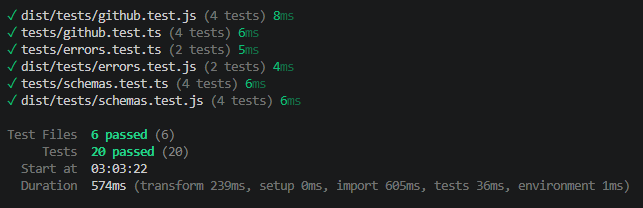
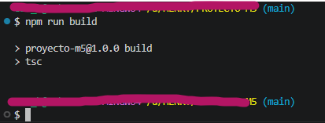

# Proyecto M5 - MCP Server para GitHub

MCP Server desarrollado con Node.js y TypeScript que permite a un agente de IA ejecutar operaciones comunes en GitHub usando lenguaje natural mediante Model Context Protocol.

## Descripción

Este proyecto expone herramientas MCP para automatizar tareas repetitivas en GitHub, como crear repositorios, listar repositorios, crear issues, listar issues y crear commits.

El servidor se conecta con un Host compatible con MCP, como Antigravity IDE, y permite que un LLM invoque tools según el prompt del usuario.

## Casos de uso

* Automatizar tareas comunes de GitHub desde lenguaje natural.
* Crear repositorios rápidamente.
* Registrar issues sin entrar manualmente a GitHub.
* Consultar issues abiertos.
* Crear o modificar archivos mediante commits automatizados.
* Integrar agentes de IA con flujos de desarrollo reales.

## Tecnologías utilizadas

* Node.js 18+
* TypeScript
* Model Context Protocol SDK
* Octokit
* Zod
* Vitest
* dotenv
* Antigravity IDE
* MCP Inspector

## Estructura del proyecto

```text
docs/
└── screenshots/
    ├── antigravity-tools.png
    ├── mcp-inspector.png
    ├── tests.png
    └── build.png
src/
├── errors/
│   └── index.ts
├── github/
│   ├── client.ts
│   └── operations.ts
├── schemas/
│   └── index.ts
├── tools/
│   └── index.ts
└── server.ts

tests/
├── errors.test.ts
├── github.test.ts
└── schemas.test.ts
```

## Arquitectura

```text
Usuario
   │
   ▼
Antigravity IDE
   │
   ▼
LLM / Cliente MCP
   │
   ▼
GitHub MCP Server
   │
   ├── Validación (Zod)
   ├── Tools MCP
   └── GitHub Operations
           │
           ▼
        Octokit
           │
           ▼
       GitHub API
```

El usuario escribe un prompt en lenguaje natural. El LLM interpreta la intención, selecciona la tool adecuada y envía los parámetros al MCP Server. El servidor valida los datos con Zod y ejecuta la operación correspondiente contra GitHub usando Octokit.

## Instalación

Clonar el repositorio:

```bash
git clone https://github.com/AlanEzequiel112/Proyecto-m5-mcp-github
cd Proyecto-m5-mcp-github
```

Instalar dependencias:

```bash
npm install
```

Compilar TypeScript:

```bash
npm run build
```

Ejecutar tests:

```bash
npm test
```

Ejecutar en modo desarrollo:

```bash
npm run dev
```

## Variables de entorno

Crear un archivo `.env` en la raíz del proyecto:

```env
GITHUB_TOKEN=tu_token_de_github
```

El archivo `.env` no debe subirse al repositorio.

El archivo `.env.example` contiene la estructura esperada sin valores reales.

## Cómo obtener un GitHub Personal Access Token

1. Ir a GitHub.
2. Entrar en Settings.
3. Ir a Developer settings.
4. Entrar en Personal access tokens.
5. Crear un token classic.
6. Asignar los scopes necesarios.
7. Copiar el token y guardarlo en `.env`.

Scopes utilizados:

* `repo`
* `user`
* `admin:org`

## Configuración en Antigravity IDE

Abrir Antigravity IDE y entrar al proyecto.

Luego:

1. Presionar `Ctrl + Shift + P`.
2. Buscar `MCP`.
3. Seleccionar `Antigravity IDE: Manage MCP Servers`.
4. Entrar en `View raw config`.
5. Configurar el archivo `mcp_config.json`.

Ejemplo de configuración:

```json
{
  "mcpServers": {
    "github-mcp-server": {
      "command": "node",
      "args": [
        "node_modules/tsx/dist/cli.mjs",
        "src/server.ts"
      ],
      "env": {
        "GITHUB_TOKEN": "<TU_TOKEN>"
      }
    }
  }
}
```
Ajustar las rutas según la ubicación local del proyecto.

Después de guardar la configuración, volver a `Manage MCP Servers` y presionar `Refresh`.

El server debe aparecer habilitado con 5 tools disponibles.

## Tools disponibles

### create_repository

Crea un nuevo repositorio en la cuenta autenticada de GitHub.

Parámetros:

* `name`: string. Nombre del repositorio.
* `description`: string opcional. Descripción del repositorio.
* `private`: boolean opcional. Define si el repositorio será privado.

Ejemplo de prompt:

```text
Crea un repositorio llamado demo-mcp con descripción Proyecto de prueba MCP.
```

### list_repositories

Lista repositorios del usuario autenticado.

Parámetros:

* `perPage`: number opcional. Cantidad de repositorios a listar.

Ejemplo de prompt:

```text
Listá mis últimos 10 repositorios de GitHub.
```

### create_issue

Crea un issue en un repositorio específico.

Parámetros:

* `owner`: string. Usuario u organización propietaria.
* `repo`: string. Nombre del repositorio.
* `title`: string. Título del issue.
* `body`: string. Descripción del issue.

Ejemplo de prompt:

```text
Crea un issue en AlanEzequiel112/demo-mcp con título "Bug login" y descripción "El login falla con credenciales válidas".
```

### list_issues

Lista issues de un repositorio.

Parámetros:

* `owner`: string. Usuario u organización propietaria.
* `repo`: string. Nombre del repositorio.
* `state`: "open", "closed" o "all".

Ejemplo de prompt:

```text
Listá los issues abiertos del repositorio AlanEzequiel112/demo-mcp.
```

### create_commit

Crea o modifica un archivo en un repositorio mediante un commit.

Parámetros:

* `owner`: string. Usuario u organización propietaria.
* `repo`: string. Nombre del repositorio.
* `path`: string. Ruta del archivo.
* `content`: string. Contenido del archivo.
* `message`: string. Mensaje del commit.
* `branch`: string opcional. Rama destino, por defecto `main`.

Ejemplo de prompt:

```text
En el repo AlanEzequiel112/demo-mcp, crea un archivo README.md con el contenido "Hola mundo" y mensaje de commit "agregar README inicial".
```

## Validaciones

Los parámetros de entrada se validan con Zod antes de llamar a GitHub.

Ejemplos de validaciones:

* El nombre del repositorio debe tener entre 3 y 100 caracteres.
* Solo se permiten letras, números y guiones en nombres de repositorios.
* Los campos obligatorios no pueden estar vacíos.
* Los estados de issues solo pueden ser `open`, `closed` o `all`.

## Manejo de errores

El proyecto define y transforma errores en mensajes comprensibles:

* `ValidationError`
* `AuthenticationError`
* `GitHubAPIError`
* `NetworkError`

Ejemplo:

```text
El repositorio solicitado no fue encontrado. Verifica el owner y el nombre.
```

Esto evita exponer stack traces técnicos al usuario final o al LLM.

## Testing

El proyecto usa Vitest.

Ejecutar tests:

```bash
npm test
```

Los tests cubren:

* Validación de schemas.
* Transformación de errores.
* Uso de mocks.
* Casos básicos de comportamiento esperado.

Actualmente el proyecto cuenta con más de 8 tests unitarios pasando.

## Verificación con MCP Inspector

Para validar el servidor antes de usarlo en Antigravity:

```bash
npx @modelcontextprotocol/inspector
```

Configuración usada:

```text
Transport Type: STDIO
Command: npm
Arguments: run dev
```

Desde el Inspector se puede usar `List Tools` para confirmar que aparecen:

* `create_repository`
* `list_repositories`
* `create_issue`
* `list_issues`
* `create_commit`

## Troubleshooting

### Error: GITHUB_TOKEN no configurado

Verificar que exista el archivo `.env` y que contenga:

```env
GITHUB_TOKEN=tu_token_real
```

### Error de autenticación

Verificar que el token sea válido y tenga los scopes correctos.

### Antigravity no detecta las tools

Revisar:

* Que el path del archivo `server.ts` sea correcto.
* Que el token esté configurado.
* Que no existan logs en stdout que rompan la comunicación por stdio.
* Que el servidor funcione primero en MCP Inspector.

### Error por logs en stdio

MCP por stdio requiere que el servidor no imprima texto extra en stdout. Por eso se evita usar logs directos como `console.log` en el flujo principal del server.

### Tests fallan

Ejecutar:

```bash
npm install
npm test
```

### Build falla

Ejecutar:

```bash
npm run build
```

y revisar errores de TypeScript.

## Decisiones técnicas

* Se separó la configuración de Octokit en `client.ts`.
* Se separaron las operaciones de GitHub en `operations.ts`.
* Se centralizaron los schemas en `schemas/index.ts`.
* Se agregaron errores custom para transformar errores técnicos en mensajes claros.
* Se usó Zod para validar inputs antes de llamar a GitHub.
* Se usó Vitest para validar comportamiento sin depender de llamadas reales a la API.

## Licencia

MIT

## Evidencias de funcionamiento

### Antigravity IDE

El servidor MCP fue reconocido correctamente por Antigravity IDE y registró las 5 herramientas implementadas:

- create_repository
- list_repositories
- create_issue
- list_issues
- create_commit



---

### MCP Inspector

Las herramientas fueron verificadas utilizando MCP Inspector.



---

### Tests

Todos los tests unitarios fueron ejecutados exitosamente.



---

### Build

La compilación TypeScript se ejecutó sin errores.



## Autor

Ezequiel Cardiello

Proyecto Individual M5 - Henry